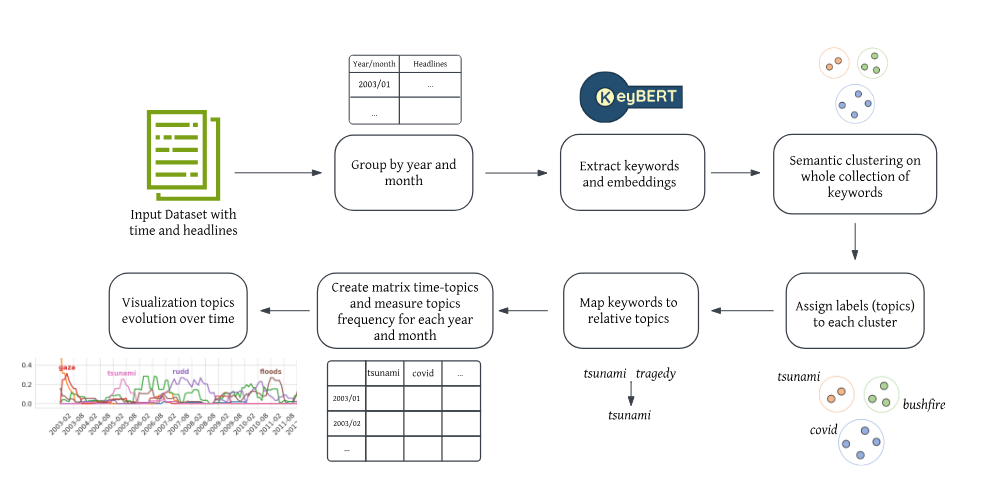
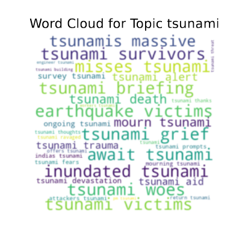
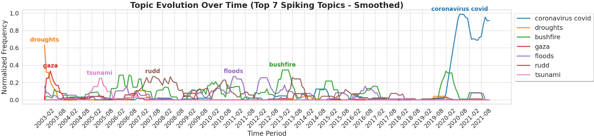

## Dynamic Topic Modeling Overview
Using KeyBERT, we extract meaningful keywords from time-stamped textual data and apply semantic clustering to group them into relevant topics. We then analyze topic evolution over time to uncover interesting trends.

The pipeline follows these steps:

    Input Dataset:
    A dataset containing time-stamped textual data (e.g., news headlines) is provided.

    Grouping by Time Period:
    Text data is grouped by year and month.

    Keyword Extraction:
    We utilize KeyBERT to extract meaningful keywords from the dataset for each year and month.

    Semantic Clustering:
    Extracted keywords are clustered based on their semantic similarity to form coherent topics.

    Topic Labeling:
    Each cluster is assigned a label that best represents the underlying topic.

    Topic Evolution Analysis:
        A matrix of topics over time is created to track topic frequency for each time period.
        Visualizations are generated to highlight the emergence, peaks, and decline of different topics over time.

  

This pipeline can be used for news trend analysis, research trend discovery, and other time-based textual insights.

Example Outputs
1. Word Cloud Representation

To better understand each topic, we generate word clouds that showcase the most frequent words associated with a given topic.

  

2. Topic Evolution Over Time

A key aspect of this project is analyzing how topics emerge, evolve, and disappear over time. The visualization below displays the normalized frequency of the top spiking topics across multiple years.

  

